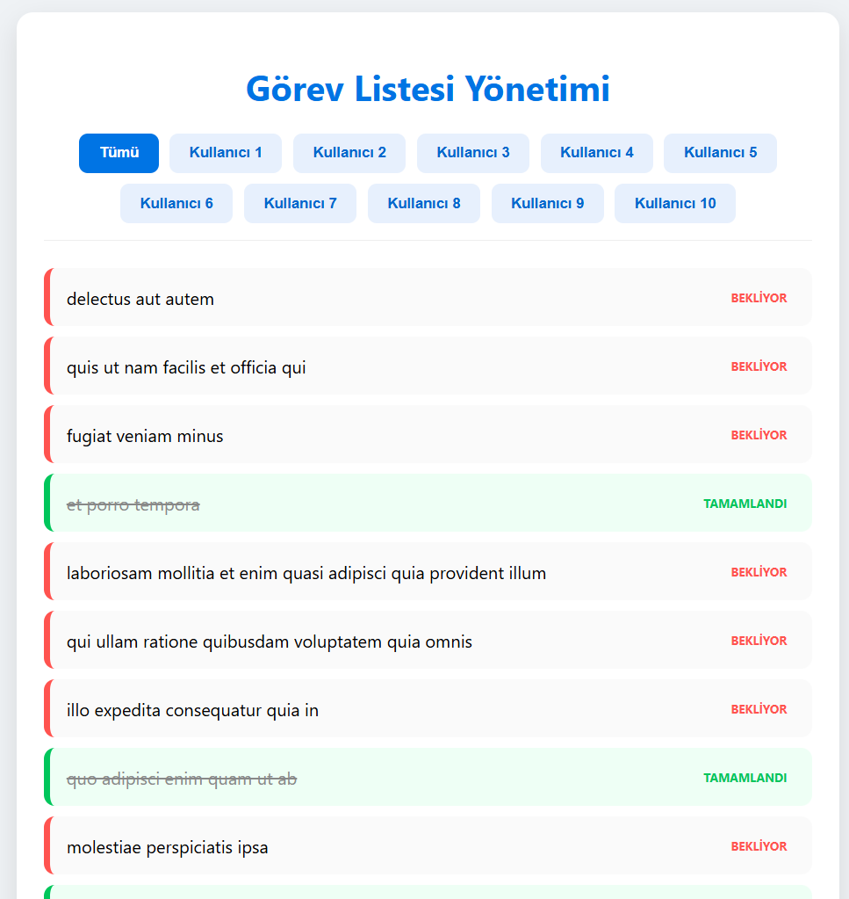

# API-Integration-Asynchronous-UI
# 🚀 Dynamic API To-Do Manager / Dinamik API Görev Yöneticisi

[Türkçe açıklamalar için aşağı kaydırın / Scroll down for Turkish]

---

## 🇺🇸 Project Overview
This project is an advanced, asynchronous web application that demonstrates real-time data integration and dynamic UI management. It fetches data from a REST API and provides a high-performance filtering system without any page reloads.

### 📋 Key Technical Features
- **Asynchronous Data Fetching:** Utilizes the `Fetch API` to retrieve and process large datasets from JSONPlaceholder.
- **Dynamic Component Architecture:** User interface elements (filter buttons) are generated programmatically based on the unique `userId` values present in the live data.
- **Advanced DOM Management:** Demonstrates the ability to inject global CSS styles dynamically via JavaScript (**CSS-in-JS**) to ensure a modular and self-contained application structure.
- **State-Based UI Updates:** Features conditional rendering to provide visual feedback for task status (Completed vs. Pending) and active filter states.

### 🛠 Tech Stack
- **JavaScript (ES6+):** Async logic, Array methods (`map`, `filter`, `Set`), and Arrow functions.
- **REST API:** Integration with JSONPlaceholder for live data simulation.
- **CSS3 & HTML5:** Modern UI patterns, Flexbox layouts, and dynamic styling.

---

## 🇹🇷 Proje Hakkında
Bu proje, gerçek zamanlı veri entegrasyonu ve dinamik arayüz yönetimini sergileyen ileri seviye asenkron bir web uygulamasıdır. Verileri bir REST API üzerinden çeker ve sayfa yenilenmesine ihtiyaç duymadan yüksek performanslı bir filtreleme sistemi sunar.

### 📋 Teknik Özellikler
- **Asenkron Veri Yönetimi:** JSONPlaceholder üzerinden büyük veri setlerini almak ve işlemek için `Fetch API` kullanımı.
- **Dinamik Bileşen Mimarisi:** Filtreleme butonları gibi arayüz elemanları, gelen verideki benzersiz `userId` değerlerine göre programatik olarak oluşturulur.
- **Gelişmiş DOM Yönetimi:** Modüler bir yapı sağlamak amacıyla, global CSS stillerinin JavaScript üzerinden dinamik olarak enjekte edilmesi (**CSS-in-JS**) tekniği kullanılmıştır.
- **Durum Bazlı Arayüz Güncellemeleri:** Görev durumları (Tamamlandı/Bekliyor) ve aktif filtre seçimleri için koşullu görsel geri bildirim sistemi.

### 🛠 Kullanılan Teknolojiler
- **JavaScript (ES6+):** Asenkron mantık, Dizi metodları (`map`, `filter`, `Set`), Arrow functions.
- **REST API:** Canlı veri simülasyonu için JSONPlaceholder entegrasyonu.
- **CSS3 & HTML5:** Modern UI desenleri, Flexbox yerleşimi ve dinamik stil yönetimi.

---

## 📸 Preview / Önizleme

## 🚀 How to Run / Nasıl Çalıştırılır
1. Clone this repository. / Repoyu bilgisayarınıza klonlayın.
2. Open `furkan_web_project.html` in any modern web browser. / Herhangi bir modern tarayıcıda dosyayı açın.
3. Use the dynamic buttons to filter tasks by User ID. / Kullanıcı ID'lerine göre görevleri filtrelemek için dinamik butonları kullanın.
